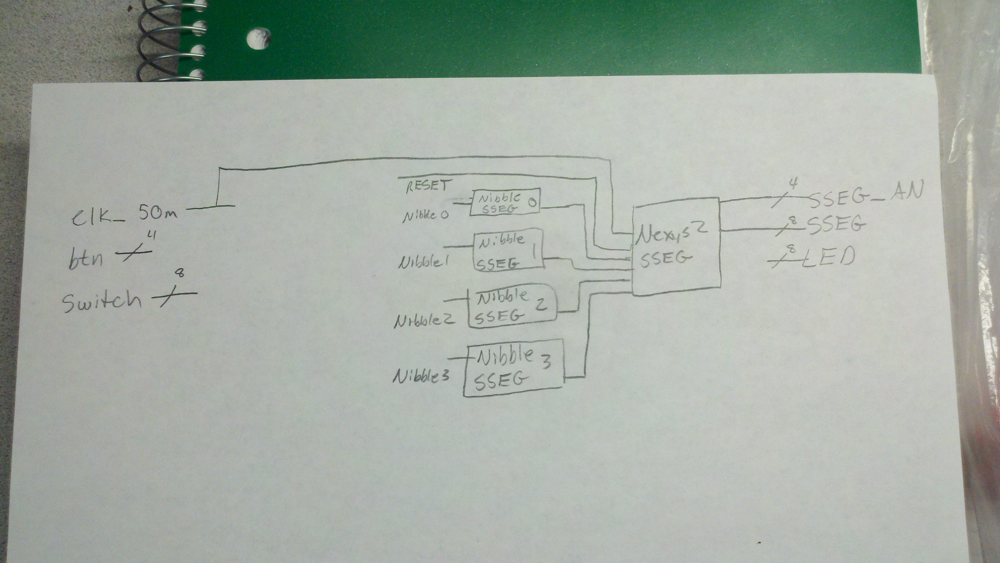

ECE281_Lab3
===========

Elevator Controller Implementation

## Prelab 

### Nexys2_top_shell Schematic

## Main Lab

### Basic Moore Functionality

### Basic Mealey Functionality

### More Floors

### More Inputs

### Moving Lights

## Code Critique
